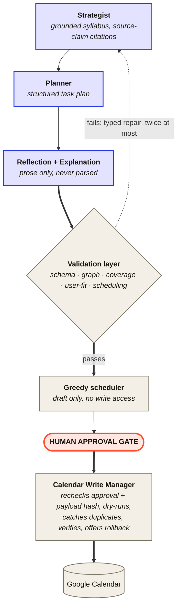

  <picture>
    <source media="(prefers-color-scheme: dark)" srcset="assets/banner-dark.svg">
    <source media="(prefers-color-scheme: light)" srcset="assets/banner-light.svg">
    
  </picture>

  <code>UC Irvine '26 → Columbia MSCS</code> · <code>Open to Applied-AI / ML / SWE</code> · <code>● loop-study.com is live</code>

  <a href="https://shawnnnliu.github.io/">Portfolio</a> ·
  <a href="https://loop-study.com">Loop</a> ·
  <a href="https://openreview.net/profile?id=%7EXiangjian_Liu1">OpenReview</a> ·
  <a href="https://www.linkedin.com/in/xiangjian-shawn-liu/">LinkedIn</a> ·
  <a href="mailto:xl3704@columbia.edu">Email</a>

---

### Pick your path

| If you're a… | Start here | Why |
| :-- | :-- | :-- |
| **Recruiter / hiring manager** | [Receipts](#receipts) | Every claim below has a number and a link that proves it. |
| **Researcher** | [Research](#research) | Six papers, what I actually did on each, honest status labels. |
| **Engineer** | [Loop](#loop) | An architecture diagram, and why an LLM app has 5,135 tests. |

---

## The throughline

Most people read my profile as two unrelated people: an ML researcher who publishes on encrypted inference and neurosymbolic robustness, and a full-stack engineer who ships web products.
It's one idea.

My research is about systems that **degrade predictably**: how CKKS noise erodes a hypervector's similarity margin, how a classical-neural fusion loses accuracy gracefully under attack instead of falling off a cliff, how a beat-wise data split quietly manufactures a 98% accuracy that doesn't survive contact with a new patient.
My engineering is the same instinct pointed at production: validation layers, human approval gates, typed failure reasons, rollback paths.

I don't trust a model I can't bound.
That's the whole résumé.

---

## Loop

**LLMs propose. Deterministic infrastructure disposes.**

[Loop](https://loop-study.com) turns a career goal, your real weekly availability, and your progress signals into a validated study plan, then drafts it as an actual week on your Google Calendar.
Four LLM nodes write the plans and the prose.
Everything that can *touch* your calendar is deterministic, validated, and waits for your say-so.

I built it because I wanted it, and I use it daily.

**Cobalt** = the four LLM nodes, sealed in one package.  **Paper** = deterministic code.  **Coral** = you.

The LLM SDK **cannot be imported** outside that first package.
`import-linter` fails the build if you try.

<b>Why an LLM app has 5,135 tests</b>

 

Because the failure mode isn't "the model said something dumb," it's "the model said something dumb and it landed on your calendar at 8am Tuesday."

The interesting tests aren't the model's outputs, they're the boundary.
Five deterministic checks sit between any LLM proposal and your calendar: schema, graph, coverage, user-fit, scheduling.
A failure goes *back* to the LLM as a typed repair message, twice at most, then gives up honestly rather than degrading silently.

One supervisor state machine owns every transition, and every failure carries a typed reason code.
Calendar sync is reconciliation-based: your real calendar is authoritative for overlap, valid external changes get adopted, and deleted events are remembered so they don't resurrect.

4,822 backend + 313 frontend, green in CI.

<b>How the eval harness catches an unmeasured prompt change</b>

 

Every LLM call lands in a SQLite call log with tokens, cost, and latency.
A capture tool records real model outputs into committed recordings, and CI re-grades those deterministically: schema validity, repair recovery, plan-quality metrics, plus an offline LLM judge for the prose.

Live API calls never run in CI.
Prompt bytes are **version-pinned by hash**, so a prompt change that ships without a measurement fails the build.
Prompt and model changes go out with before/after deltas in the commit message. The Strategist prompt is at v8.

One fixture still deliberately fails, so I know the gate actually catches regressions.

<b>Grounding: syllabi aren't generated from vibes</b>

 

242 curated source documents, split into 7,776 retrieval chunks, behind BM25-first retrieval with deterministic source-confidence scoring.
Every claim in a plan can point back at where it came from, and the bibliography is auto-generated from the same corpus.

Retrieval is deterministic code.
The LLM only consumes what it's handed.

<b>Deployment, and why it's deliberately boring</b>

 

One Docker image on Fly.io.
A two-stage build compiles the React SPA under Node 20, then a `python:3.11-slim` stage installs exact-pinned deps with `uv sync --frozen`, so no Node and no dev tooling reach production.

A single uvicorn process serves the API, the built SPA, and the static pages.
Single-process on one always-on machine **on purpose**: SQLite with WAL is a one-process store, so there's no worker pool and no autoscaler fighting over the database.

State lives on a persistent volume, OAuth tokens are encrypted at rest, every secret is injected at runtime.
Loop never stores raw calendar event titles or descriptions.

`Python 3.11` `FastAPI` `Pydantic v2` `SQLite + WAL` `React + TS + Vite` `Anthropic Messages API` `Google Calendar OAuth` `Docker` `Fly.io`

---

## Receipts

Everyone says "production-grade." Here's what I mean by it, with the number attached.

| Claim | The number | Where to check |
| :-- | :-- | :-- |
| LLM output never reaches your calendar unchecked | **5** deterministic validation checks, **≤2** typed repairs, then honest failure | [loop-study.com](https://loop-study.com) |
| Nothing writes without you | **1** human approval gate; the writer rechecks approval + payload hash, dry-runs, verifies, offers rollback | [case study](https://shawnnnliu.github.io/#loop) |
| Prompt changes ship measured, not vibed | **8** versioned eval sets; CI re-grades committed recordings; prompts pinned by hash | [Agentic-Calendar](https://github.com/ShawnnnLiu/Agentic-Calendar) |
| Tested like infrastructure | **4,822** backend + **313** frontend tests, green in CI | [Agentic-Calendar](https://github.com/ShawnnnLiu/Agentic-Calendar) |
| Cost is a design constraint, not a surprise | **$1.70**/user/month expected, worked out in a written axiom. Hard cap **$8** | [case study](https://shawnnnliu.github.io/#loop) |
| Plans cite their sources | **242** curated documents → **7,776** retrieval chunks, BM25-first | [loop-study.com](https://loop-study.com) |
| Decisions are written down before they're built | **23** axioms + **10** ADRs | [Agentic-Calendar](https://github.com/ShawnnnLiu/Agentic-Calendar) |
| A crash warning arrives early enough to matter | **3.05 s** mean time-to-accident, streaming at **408 fps** from a 2.95M-param student | [Crash-Anticipation](https://github.com/ShawnnnLiu/Crash-Anticipation) |
| Encrypted inference stays usable | **>90%** accuracy under CKKS-FHE at **4×** lower bootstrapping overhead | IEEE TAI (under review) |

---

## Research

Secure ML inference (FHE/CKKS), neurosymbolic AI, and hyperdimensional computing.
Six papers: four accepted or published, two under review.
I label the under-review ones as under review, because the alternative is the thing my arrhythmia paper is about.

| Venue | Paper | My role | |
| :-- | :-- | :-- | :-- |
| **WACV 2026** | Cross-Modal Event Encoder: Bridging Image–Text Knowledge to Event Streams | lead + corresponding | [arXiv](https://arxiv.org/abs/2412.03093) |
| **NeurIPS 2025** · NeurReps | Geometric Priors for Generalizable World Models via VSA | co-author | [OpenReview](https://openreview.net/forum?id=0MJ1PW2vE8) |
| **ISLPED 2026** | Integrating Symbolic & Neural Mechanisms for Adversarially Robust HDC | co-author | `10.1145/3816440.3818596` |
| **Frontiers in AI** | Optimal Hyperdimensional Representation for Learning & Cognitive Computation | co-author | [Paper](https://www.frontiersin.org/journals/artificial-intelligence/articles/10.3389/frai.2026.1690492/full) |
| **IEEE TAI 2026** · *under review* | Robust Reasoning & Learning with Brain-Inspired Representations under FHE | lead + corresponding | *(preprint on request)* |
| **IEEE TAI 2026** · *under review* | HyperEncrypt: Homomorphic HDC for Efficient & Secure Learning | co-author | *(preprint on request)* |

<table>
<tr>
<td width="50%" valign="top">

<b>WACV 2026.</b> Our event encoder attends to body and tail structure from <i>event data alone</i>. CLIP's understanding transfers, while attributes absent from events (like colour) are correctly ignored. <b>+15.2 pts</b> zero-shot on unseen N-ImageNet classes.
</td>
<td width="50%" valign="top">

<b>NeurIPS 2025 NeurReps.</b> VSA (FHRR) learns grid-like state embeddings that preserve geometry; an MLP baseline learns no such structure. <b>87.5%</b> zero-shot accuracy and <b>4×</b> noise robustness.
</td>
</tr>
</table>

Grateful to research with **Prof. Mohsen Imani** (BiasLab @ UCI) and **Dr. Haleh Alimohamadi** (BioIntelligence Lab @ UCI).

---

## Shipped

| | What it is | The honest headline |
| :-- | :-- | :-- |
| 🛬 **Safe UAV Landing**   U.S. Navy collaboration | Pose estimation + symbolic reasoning replacing brittle fixed-pattern optical markers for autonomous carrier landing in bad weather. | A reasoning module that **holds the landing** whenever crew or obstacles are on the deck. CUI dataset, visuals restricted. |
| 🚗 **[Crash Anticipation](https://github.com/ShawnnnLiu/Crash-Anticipation)**   v0.3.0 | Online crash-risk prediction from one dashcam. A neural model decides *whether* it's dangerous; a symbolic layer decides *what the threat is* and can always explain itself. | **3.05 s** mean warning at **408 fps**, from a distilled 2.95M-param student that beats its 21.88M teacher on lead time. And it's still image-space geometry, not spatial understanding, and [I say so out loud](https://shawnnnliu.github.io/#projects). |
| 🫀 **[Arrhythmia, Honestly Evaluated](https://github.com/ShawnnnLiu/Arrythmia_Classifier)** | Shows how beat-wise splits leak patient identity and inflate ECG accuracy, then searches for an optimal patient-wise split. | **98.4% → 89.7%.** The gap *is* the paper. |
| 🧬 **[Antimicrobial Peptides](https://github.com/ShawnnnLiu/Peptide-Anti-microbial-Properties-Prediction)** | Fuses biochemical descriptors with structure-aware features from ESMFold conformations across SVM / MLP / GNN. | Ongoing: isolating what 3D conformation actually contributes. |
| 🛒 **[AdamsFoods Wholesale](https://adamsfoodswholesale.com/)**   ● live, solo build | React + Node/Express wholesale platform, signed-URL S3 media, JWT auth with role-guarded admin routes. | Real customers, today. |
| 🐾 **Feeding Pets of the Homeless**   CTC @ UCI | Donation-management platform for a national nonprofit, role-based across regional chapters. | Built and maintained free of charge. |

Also kicking around: **[Astrolabe](https://github.com/ShawnnnLiu/Astrolabe)** (LLM course-selection for Columbia, built by someone about to need it), **[Robust-NeRF](https://github.com/ShawnnnLiu/Robust-NeRF)**, and a [search engine over UCI](https://github.com/ShawnnnLiu/UCI-DIR-Search-Engine) with tf-idf scoring and an inverted index.

---

## Recent

<!-- NEWS:START -->
- **Jul 2026** · **Loop** is deployed live at [loop-study.com](https://loop-study.com): an LLM-powered interview-prep scheduler with deterministic validation, human approval gates, and a recordings-based eval harness. I built it for my own daily use. [[Case study]](https://shawnnnliu.github.io/#loop)
- **May 22, 2026** · **Integrating Symbolic and Neural Mechanisms for Adversarially Robust Hyperdimensional Computing** was accepted to *ISLPED 2026*.
- **Apr 5, 2026** · **Live Spotify Stats**: feel free to stalk my recent listening history and see how our music tastes match up :)
- **Jan 19, 2026** · **Optimal Hyperdimensional Representation for Learning and Cognitive Computation**: third author, accepted to *Frontiers in Artificial Intelligence*. [[Paper]](https://www.frontiersin.org/journals/artificial-intelligence/articles/10.3389/frai.2026.1690492/full)
<!-- NEWS:END -->

Auto-synced from <a href="https://shawnnnliu.github.io/#news">shawnnnliu.github.io</a>.

---

## Off the clock

I live with two cats, listen to an unreasonable amount of D'Angelo, and spend my free time shooting hoops, snowboarding, or in Night City.

<table>
<tr>
<td width="34%" valign="top">

<!-- CAT:START -->

<b>Cat of the day</b> · Coconut &amp; Kumquat 🐱 · rotates daily from a pool of 21
<!-- CAT:END -->

</td>
<td width="66%" valign="top">

<!-- SPOTIFY:START -->
<b>On repeat lately</b> 

<b>Just played</b> · Charcoal Baby <i>Blood Orange</i> · Like a Tattoo <i>Sade</i> · Who&#x27;s Lovin&#x27; You <i>The Jackson 5</i> 
<a href="https://shawnnnliu.github.io/#about">Full listening stats →</a>
<!-- SPOTIFY:END -->

</td>
</tr>
</table>

---

  <b>Let's build something that ships.</b> 
  <a href="mailto:xl3704@columbia.edu">xl3704@columbia.edu</a> ·
  <a href="https://shawnnnliu.github.io/assets/CV/Shawn_Liu_CV_Research.pdf">CV</a> ·
  <a href="https://www.linkedin.com/in/xiangjian-shawn-liu/">LinkedIn</a>

  The Spotify feed, the cat, and the news block above are rebuilt on a schedule by <a href=".github/workflows/update-readme.yml">a GitHub Action</a>. 
  Every link in this file is checked in CI, because a README with dead links is a README that lies.

