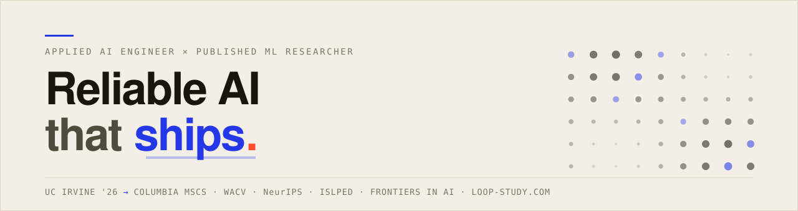

  <picture>
    <source media="(prefers-color-scheme: dark)" srcset="assets/banner-dark.svg">
    <source media="(prefers-color-scheme: light)" srcset="assets/banner-light.svg">
    
  </picture>

  <code>UC Irvine '26 → Columbia MSCS</code> · <code>Open to Applied-AI / ML / SWE</code> · <code>● loop-study.com is live</code>

  <a href="https://shawnnnliu.github.io/">Portfolio</a> ·
  <a href="https://loop-study.com">Loop</a> ·
  <a href="https://openreview.net/profile?id=%7EXiangjian_Liu1">OpenReview</a> ·
  <a href="https://www.linkedin.com/in/xiangjian-shawn-liu/">LinkedIn</a> ·
  <a href="mailto:xl3704@columbia.edu">Email</a>

---

### Pick your path

| If you're a… | Start here | Why |
| :-- | :-- | :-- |
| **Recruiter / hiring manager** | [Shipped](#shipped) | What I've built, and what each one actually does. |
| **Researcher** | [Research](#research) | Six papers, honest status labels. |
| **Engineer** | [Loop](#loop) | Why an LLM app has 5,135 tests. |

---

## Loop

**LLMs propose. Deterministic infrastructure disposes.**

[Loop](https://loop-study.com) turns a career goal, your weekly availability, and your progress signals into a validated study plan, then drafts it onto your Google Calendar.
I use it daily.

Four LLM nodes write the plans.
Everything downstream is deterministic: five checks stand between any proposal and your calendar, a failure goes back to the model as a typed repair twice at most and then fails honestly, and nothing is written until you approve it.
**5,135 tests**, because the failure mode isn't a dumb model output, it's a dumb model output landing on your calendar at 8am Tuesday.
Prompts are pinned by hash and re-graded offline in CI, so an unmeasured prompt change fails the build.
Plans cite sources: 242 curated documents behind BM25-first retrieval.

`Python 3.11` `FastAPI` `Pydantic v2` `SQLite + WAL` `React + TS + Vite` `Anthropic Messages API` `Google Calendar OAuth` `Docker` `Fly.io`

---

## Research

Secure ML inference (FHE/CKKS), neurosymbolic AI, and hyperdimensional computing.
Six papers: four accepted or published, two under review, labelled honestly.

| Venue | Paper |
| :-- | :-- |
| **WACV 2026** | Cross-Modal Event Encoder: Bridging Image–Text Knowledge to Event Streams |
| **NeurIPS 2025** · NeurReps | Geometric Priors for Generalizable World Models via VSA |
| **ISLPED 2026** | Integrating Symbolic & Neural Mechanisms for Adversarially Robust HDC |
| **Frontiers in AI** | Optimal Hyperdimensional Representation for Learning & Cognitive Computation |
| **IEEE TAI 2026** · *under review* | Robust Reasoning & Learning with Brain-Inspired Representations under FHE |
| **IEEE TAI 2026** · *under review* | HyperEncrypt: Homomorphic HDC for Efficient & Secure Learning |

The event encoder gets **+15.2 pts** zero-shot on unseen N-ImageNet classes by transferring CLIP's understanding to event streams alone.
The VSA world model learns grid-like state embeddings an MLP baseline never finds: **87.5%** zero-shot accuracy at **4×** noise robustness.

Grateful to research with **Prof. Mohsen Imani** (BiasLab @ UCI) and **Dr. Haleh Alimohamadi** (BioIntelligence Lab @ UCI).

---

## Shipped

| | What it is |
| :-- | :-- |
| 🛬 **Safe UAV Landing**   U.S. Navy collaboration | Pose estimation + symbolic reasoning replacing brittle fixed-pattern optical markers for autonomous carrier landing in bad weather. |
| 🚗 **[Crash Anticipation](https://github.com/ShawnnnLiu/Crash-Anticipation)**   v0.3.0 | Online crash-risk prediction from one dashcam. A neural model decides *whether* it's dangerous; a symbolic layer decides *what the threat is* and can always explain itself. |
| 🫀 **[Arrhythmia, Honestly Evaluated](https://github.com/ShawnnnLiu/Arrythmia_Classifier)** | Shows how beat-wise splits leak patient identity and inflate ECG accuracy, then searches for an optimal patient-wise split. |
| 🧬 **[Antimicrobial Peptides](https://github.com/ShawnnnLiu/Peptide-Anti-microbial-Properties-Prediction)** | Fuses biochemical descriptors with structure-aware features from ESMFold conformations across SVM / MLP / GNN. |
| 🛒 **[AdamsFoods Wholesale](https://adamsfoodswholesale.com/)**   ● live, solo build | React + Node/Express wholesale platform, signed-URL S3 media, JWT auth with role-guarded admin routes. |
| 🐾 **Feeding Pets of the Homeless**   CTC @ UCI | Donation-management platform for a national nonprofit, role-based across regional chapters. |

Also kicking around: **[Astrolabe](https://github.com/ShawnnnLiu/Astrolabe)** (LLM course-selection for Columbia, built by someone about to need it), **[Robust-NeRF](https://github.com/ShawnnnLiu/Robust-NeRF)**, and a [search engine over UCI](https://github.com/ShawnnnLiu/UCI-DIR-Search-Engine) with tf-idf scoring and an inverted index.

---

## Recent

<!-- NEWS:START -->
- **Jul 2026** · **Loop** is deployed live at [loop-study.com](https://loop-study.com): an LLM-powered interview-prep scheduler with deterministic validation, human approval gates, and a recordings-based eval harness. I built it for my own daily use. [[Case study]](https://shawnnnliu.github.io/#loop)
- **May 22, 2026** · **Integrating Symbolic and Neural Mechanisms for Adversarially Robust Hyperdimensional Computing** was accepted to *ISLPED 2026*.
- **Apr 5, 2026** · **Live Spotify Stats**: feel free to stalk my recent listening history and see how our music tastes match up :)
- **Jan 19, 2026** · **Optimal Hyperdimensional Representation for Learning and Cognitive Computation**: third author, accepted to *Frontiers in Artificial Intelligence*. [[Paper]](https://www.frontiersin.org/journals/artificial-intelligence/articles/10.3389/frai.2026.1690492/full)
<!-- NEWS:END -->

Auto-synced from <a href="https://shawnnnliu.github.io/#news">shawnnnliu.github.io</a>.

---

  <b>Let's build something that ships.</b> 
  <a href="mailto:xl3704@columbia.edu">xl3704@columbia.edu</a> ·
  <a href="https://shawnnnliu.github.io/assets/CV/Shawn_Liu_CV_Research.pdf">CV</a> ·
  <a href="https://www.linkedin.com/in/xiangjian-shawn-liu/">LinkedIn</a>

  The news block above is rebuilt on a schedule by <a href=".github/workflows/update-readme.yml">a GitHub Action</a>. 
  Every link in this file is checked in CI, because a README with dead links is a README that lies.

